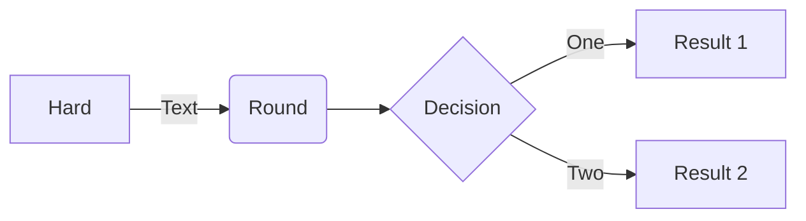
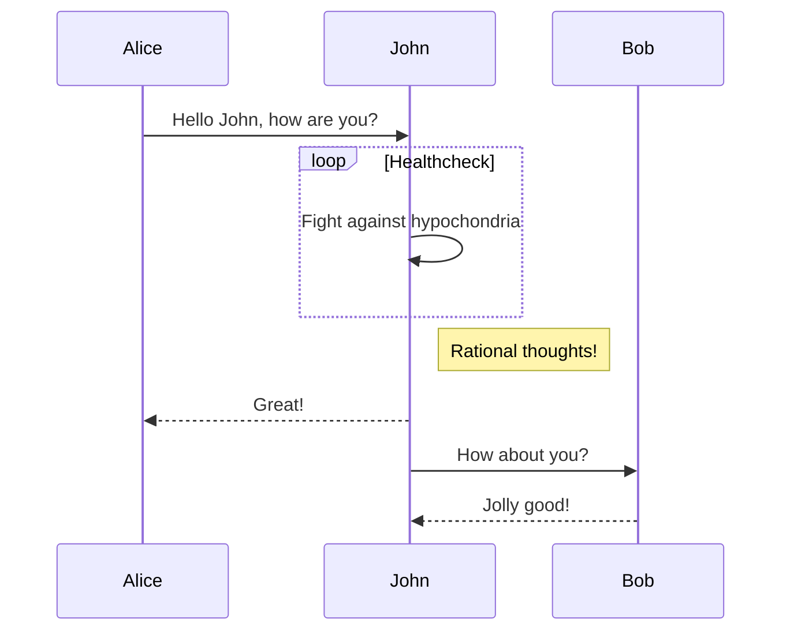

# proyectoAPACHE

Lo primero es crear la carpeta que contendrá todo lo que se quiera hacer.
Mi carpeta "server" contiene las carpetas "sitio1, sitio2, sitio HTTPS y sitioSSL". 

Ahora que está todo ordenado, busco la imagen de apache-php en hub.cokcer.com 
y configuro el **docker-compose.yml** para definir al contenedor.

Por otro lado, también contiene los archivos docker-compose.yml (el cual creo de manera manual 
igual que los demás archivos), info.php, README.md

Dentro del docker-compose.yml declaro el contenedor con su imagen, puerto y volumenes

```
version: "3.3"
services:
 apache-XD:
  container_name: apache-XD
  image: php:7.2-apache
  ports:
    - "80:80"
  volumes:
    - /home/asir2a/Escritorio/SRI/tuto/server:/var/www/html
    - configApache:/etc/apache2
volumes:
  configApache:
```
En ~/server/info.php pongo: 
```
<?php
    phpinfo();
?>
```
Una vez esto está hecho, dentro de sitio1/ creo un archivo llamado index.html en el cual pongo `<h1>hola mundo</h1>`
Ahora lo que hago es ejecutar docker-compose up y en el navegador buscar **localhost:80**

En este localhost/sitio1 aparece por pantalla <h1>hola mundo</h1>


Por otro lado, en localhost/info.php debería aparecer una tabla de información con toda la sálida de la función `phpinfo()`

# Mapeo del Documento Root

Para mapear este documento, hay que hacer un volumen asociado al root en la configuración
del documento docker-compose.yml

```
version: "3.3"
services:
 apache-XD:
  container_name: apache-XD
  image: php:7.2-apache
  ports:
    - "80:80"
  volumes:
    - /home/asir2a/Escritorio/SRI/tuto/server:/var/www/html
  **- configApache:/etc/apache2**
volumes:
 **configApache:**
```
Lo próximo que se debe hacer es ir al apartado de volúmenes del VCode y seleccionar server_configApache con el clic derecho y abrirno en un Dev Container.
Una vez allí, se puede descargar toda la configuración necesaria a la carpeta del server si así se quiere.


```
flowchart LR

A[Hard] -->|Text| B(Round)
B --> C{Decision}
C -->|One| D[Result 1]
C -->|Two| E[Result 2]
```



```
sequenceDiagram
Alice->>John: Hello John, how are you?
loop Healthcheck
    John->>John: Fight against hypochondria
end
Note right of John: Rational thoughts!
John-->>Alice: Great!
John->>Bob: How about you?
Bob-->>John: Jolly good!
```



